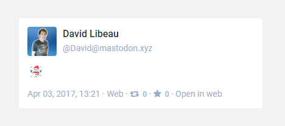

# Wordpress

Embed Mastodon statuses in your blog, or whatever Wordpress site.

[**Download plugin :arrow_down:**](https://wordpress.org/plugins/embed-mastodon/)


Just write `[mastodon url="YOU_MASTODON_STATUS_LINK"][/mastodon]` in any of your article body in order to get :




## Example

As seen at  https://blog.davidlibeau.fr/dev-test-embed-mastodon/


```
Example

[mastodon url="https://mastodon.xyz/@David/15605"][/mastodon]

https forced:
[mastodon url="https://mastodon.social/@Gargron/1"][/mastodon]

image:
[mastodon url="https://mastodon.xyz/@David/252287" height="500"][/mastodon]

spoiler:
[mastodon url="https://mastodon.xyz/@David/291091" height="250"][/mastodon]
```


> :warning: The Wordpress plugin may not work for some instances due to forced HTTPS. Feel free to help me to resolve [this issue](https://github.com/DavidLibeau/mastodon-tools/issues/1) !
